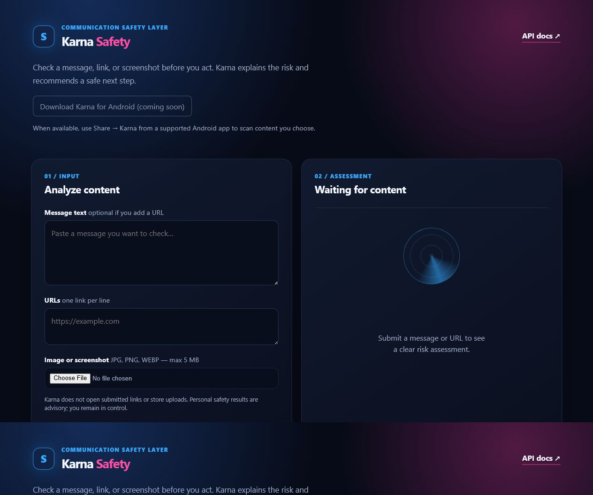

# Karna Accuracy and Quality-Assurance Report

**Report date:** 28 July 2026  
**Scope:** baseline text, URL, image-validation, dashboard, and API behavior  
**Deployment checked:** `https://data-protactor.vercel.app`

## Executive result

Karna passed **21 automated regression tests** after this review. The checks confirm that the current explainable rules produce the expected outcomes for a small, synthetic baseline set and that the dashboard renders real API assessments.

This is **not** a claim that Karna has a measured real-world detection accuracy percentage. A credible accuracy percentage needs a large, independently labeled dataset of benign and malicious messages, URLs, images, languages, and scam styles. Karna currently provides an explainable safety assessment and must remain advisory.

## What was tested

| Area | Evidence | Result |
| --- | --- | --- |
| Health and dashboard loading | Automated API tests | Pass |
| Safe text and safe URL | Automated API tests | Pass |
| Clear phishing language | Automated API and live dashboard test | Pass |
| Social-engineering payment request | Automated API test | Pass |
| Authority impersonation | Automated API test | Pass |
| Encoded-domain, IP-address, redirect, and deceptive-media URLs | Automated API tests | Pass |
| Executable download-link indicator | Automated API and live dashboard test | Pass |
| Unsupported and oversized image rejection | Automated API tests | Pass |
| Image fallback without an OpenAI key | Automated API test | Pass |
| Public configuration secrecy | Automated API test | Pass |

Run the reproducible check from the repository root:

```powershell
$env:PYTHONPATH = "src"
.\.venv\Scripts\python.exe -m pytest -q
```

Latest result: `21 passed`.

## Evidence screenshots

### 1. Live phishing test

The test message was: `Urgent: verify your account immediately with your OTP.` The live dashboard returned **critical**, **phishing**, score **80/100**, and **quarantine**, with account-verification, urgency, and credential-request evidence.


### 2. Live executable-download URL test

The test URL was: `https://example.com/update.exe`. The live dashboard returned **high**, **malware download**, score **45/100**, and **block**, with the executable-download evidence.


### 3. Dashboard ready state

The dashboard loads its text, URL, and image controls and correctly keeps the Android download control disabled until a real signed release URL is configured.



## Issue found and corrected

The new URL scenario suite found that a `private-video` link produced a deceptive-media signal but was categorized as `social_engineering`. This was inconsistent with the structured response contract because the source of the signal was the URL itself.

**Fix applied:** deceptive media-link evidence now returns the `suspicious_url` threat category. A regression test prevents this from returning.

The review also confirmed that an impersonation message containing authority pressure, a wire-transfer request, and urgency reaches the intentional critical threshold. Its expected action is therefore `quarantine`, not `block`.

## Accuracy limitations and safe interpretation

- Karna does not open, crawl, download, or execute submitted URLs.
- A clean result means no current rule matched; it does **not** prove that content is safe.
- An indicator match means caution is appropriate; it does **not** prove criminal intent.
- The optional VirusTotal lookup is only used when the deployment owner provides its key; it is not a complete malware scan.
- Image analysis without `OPENAI_API_KEY` is a transparent fallback, not visual malware detection.
- The current rules are strongest for clear English-language phishing and social-engineering patterns. They need multilingual and adversarial evaluation before any broader accuracy claim.

## Required next accuracy evaluation

Before presenting a numeric accuracy value, build a versioned test corpus with at least these groups:

1. Benign personal, banking, workplace, delivery, and support messages.
2. Confirmed phishing, impersonation, payment-scam, credential-theft, and malicious-download examples.
3. Benign URLs that resemble suspicious patterns, to measure false positives.
4. Multiple languages, regional scam styles, shortened URLs, and evasion spelling.
5. Consented screenshots labeled by at least two qualified reviewers.

For each release, record true positives, false positives, true negatives, false negatives, precision, recall, false-positive rate, and the sample size. Do not publish an accuracy percentage until the dataset, labels, and methodology are reviewable.
