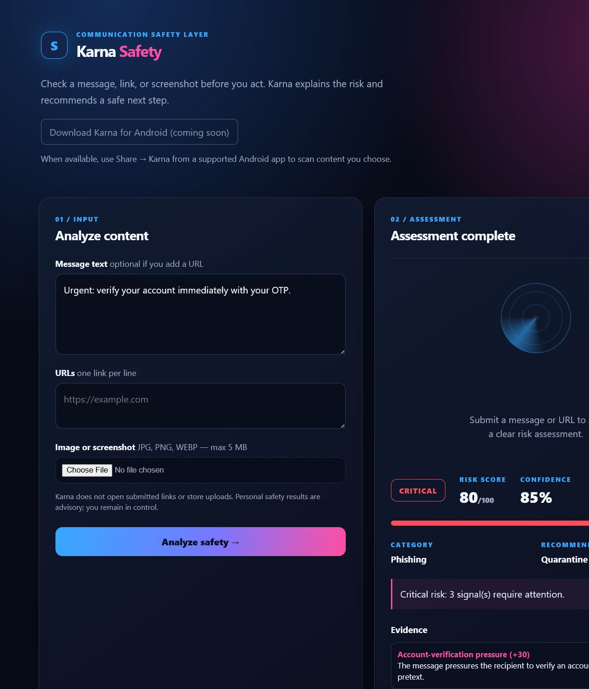
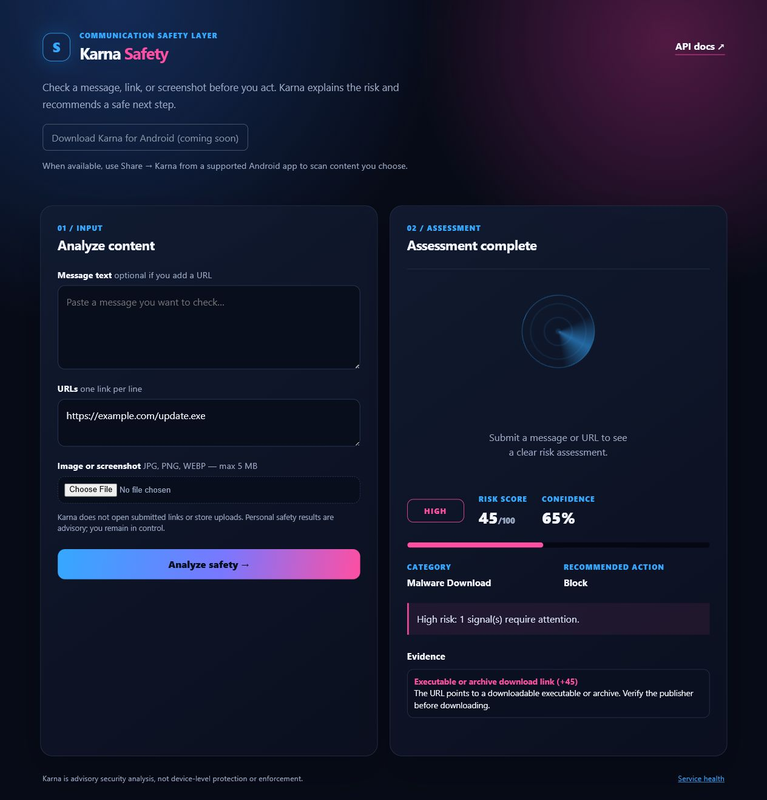

# Karna Production Accuracy, Security, and Regression Audit

**Audit date:** 28 July 2026  
**Dataset:** `tests/fixtures/evaluation_cases_v1.json`  
**Metric artifact:** `docs/evidence/evaluation_metrics_v1.json`  
**Deployment verified:** `https://data-protactor.vercel.app`

## Executive conclusion

The Karna API passed **25 automated Python tests** after this audit. A versioned synthetic evaluation corpus was added with 30 text/URL samples and four image-validation or image-capability samples. The corpus deliberately includes benign look-alikes, obvious threats, obfuscated text, Spanish and Hindi examples, and URL structure signals.

The corpus produced **20 exact category matches out of 30 evaluated text/URL samples**. This is a diagnostic result for a small synthetic corpus, **not a public real-world accuracy claim**. It exposes important false positives and false negatives, especially for natural-language, obfuscated, and multilingual messages. Karna must remain advisory.

## Test execution

| Check | Result | Evidence |
| --- | --- | --- |
| Python API, dashboard, image validation, fallback, and regression tests | Pass | `25 passed` |
| Versioned text/URL corpus | Complete | 30 evaluated samples |
| Image validation examples | Covered by API tests | 4 dataset records; semantic image scoring excluded without an OpenAI key |
| Live health endpoint | Pass | Karna health response verified |
| Live URL-category regression | Pass | `private-video` returns `suspicious_url` and `show_caution` |
| Android unit tests | Not run | This machine has no Java, Gradle, or Gradle wrapper; see limitation below |

Reproduce the Python checks from the repository root:

```powershell
$env:PYTHONPATH = "src"
.\.venv\Scripts\python.exe scripts\run_baseline_evaluation.py
.\.venv\Scripts\python.exe -m pytest -q
```

The Android source tests are located under `android/app/src/test/`. Run them in Android Studio after installing a Java 17 Gradle JDK and Android SDK, or after adding a verified Gradle wrapper. They were not represented as passing in this audit.

## Dataset methodology

The v1 corpus is a transparent, synthetic regression corpus. Each record contains an ID, modality, expected category or behavior, and an intentionally non-sensitive sample. It includes:

- five safe examples, including benign urgency and a legitimate OTP-style message to reveal false positives;
- six phishing examples, including obfuscated and Spanish variants to reveal false negatives;
- five social-engineering examples, including a Hindi variant;
- three impersonation examples;
- three prize/payment-scam examples;
- five suspicious URL structures;
- three executable or archive download links;
- four image validation/capability records.

Metrics use one-vs-rest classification for each category. `TP` means the expected and returned category match; `FP` means the category was returned for another expected label; `TN` means neither expected nor returned; `FN` means the expected category was missed. Precision, recall, F1, and false-positive rate are rounded to three decimals.

## Category metrics

| Category | TP | FP | TN | FN | Precision | Recall | F1 | False-positive rate | Sample size |
| --- | ---: | ---: | ---: | ---: | ---: | ---: | ---: | ---: | ---: |
| safe | 3 | 6 | 19 | 2 | 0.333 | 0.600 | 0.429 | 0.240 | 30 |
| phishing | 5 | 1 | 20 | 4 | 0.833 | 0.556 | 0.667 | 0.048 | 30 |
| social_engineering | 3 | 3 | 22 | 2 | 0.500 | 0.600 | 0.545 | 0.120 | 30 |
| impersonation | 2 | 0 | 27 | 1 | 1.000 | 0.667 | 0.800 | 0.000 | 30 |
| scam | 2 | 0 | 27 | 1 | 1.000 | 0.667 | 0.800 | 0.000 | 30 |
| suspicious_url | 2 | 0 | 28 | 0 | 1.000 | 1.000 | 1.000 | 0.000 | 30 |
| malware_download | 3 | 0 | 27 | 0 | 1.000 | 1.000 | 1.000 | 0.000 | 30 |

These values are useful for regression comparison only. The URL values are based on five hand-selected structural cases and must not be generalized to all malicious or safe URLs.

## Findings and fixes

### Fixed: deceptive media-link categorization

The prior audit found that `private-video` URL evidence was classified as `social_engineering`. The source of the signal is the URL, so this was corrected to `suspicious_url`. A regression test verifies the new result.

### Fixed: scam category had no active rule

The public response schema included `scam`, but the baseline detector had no corresponding rule. Prize, lottery, and processing-fee cues now produce `scam` evidence and a dedicated regression test protects that behavior.

### Known false positives and false negatives

- A benign use of `urgent` is classified as `social_engineering`.
- A legitimate OTP-style message is classified as `phishing`.
- Obfuscated phishing spelling is missed.
- Spanish phishing and Hindi social-engineering examples are not reliably detected.
- Less explicit impersonation and payment-scam wording is missed.

These are not hidden. They are retained in the dataset so future work can measure improvement without silently weakening the audit.

### Post-audit regression: suspicious cashback lure

The user-reported URL pattern `nu-cashback.link` initially had no matching structural signal. Karna now flags financial reward terms such as `cashback` only when they are combined with selected generic promotion-oriented top-level domains such as `.link`. The response is `suspicious_url` with a `block` action; this is a structural warning, not a claim that Karna has opened or proven malicious behavior on the site.

## Security and failure-path checks

- The rule-based URL analyzer does not open, crawl, download, or execute submitted URLs.
- `VirusTotalReputationService` failure is simulated and returns no reputation evidence, preserving baseline analysis.
- A simulated OpenAI vision failure returns a structured low-risk caution response and does not leak the provider error message.
- Unsupported image types and images over 5 MB are rejected.
- Image uploads are processed in memory and are not persistently stored by the API.
- `GET /config/public` exposes only the public Android download setting, never API keys.
- The GoPhish adapter is tested only with mocked metadata and is not imported by live API routes. It returns only HTTPS fixture URLs when explicitly enabled and never returns campaign targets or provider errors.
- A deceptive URL combined with login, account, OTP, password, reset, or verification wording is categorized as `phishing`; structural URL signals without credential-harvesting cues remain `suspicious_url`.

## Live test screenshots

### Phishing result

The live dashboard returned `critical`, `phishing`, score 80/100, and `quarantine` for a clear account/OTP phishing sample.



### Executable-download URL result

The live dashboard returned `high`, `malware_download`, score 45/100, and `block` for an `.exe` URL without downloading or opening it.



## Release recommendation

Keep Karna publicly described as an explainable, advisory detection API. Do not publish a numeric overall accuracy score or claim malware removal, device scanning, or automatic private-message protection.

Before a broader production launch, expand the corpus using consented or lawfully sourced samples, independently review labels, add multilingual evaluation, separate development and holdout datasets, test calibration by risk score, and run the Android suite on a configured CI runner.
