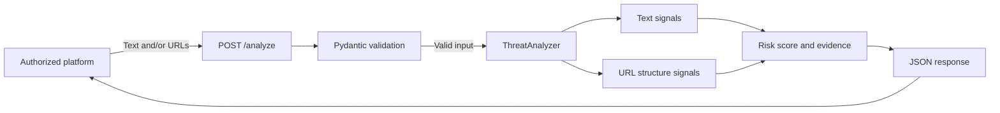

# How Karna Works

Karna is an independent REST API. An authorized product can send it content for analysis and use the returned result in its own safety workflow. Karna does not connect directly to WhatsApp, Telegram, Signal, or other closed messaging services.

## Request lifecycle

1. A platform sends text, URLs, or both to `POST /analyze`, or an image to `POST /analyze/image`.
2. The API validates the shape and size of the request. Empty submissions are rejected with a clear `422` response.
3. The baseline analyzer looks for explainable text signals, such as credential requests and urgency pressure.
4. It examines only the structure of submitted URLs, including numeric IP hosts, encoded domains, redirect-style parameters, and download indicators. It does not open or fetch links. VirusTotal enrichment is optional and uses only its reputation API.
5. Images are validated in memory. With an `OPENAI_API_KEY`, Karna can request an optional visual assessment; otherwise it returns a transparent keyless fallback.
6. The API combines the signals into a score from 0 to 100, assigns a risk level and recommended action, then returns the exact evidence that informed the result.

## Code-to-behavior map

| User-visible behavior | Code responsible |
| --- | --- |
| Starts the API | `src/sentinel_ai/main.py` |
| Accepts `/analyze` requests | `src/sentinel_ai/api/routes.py` |
| Defines valid JSON input and output | `src/sentinel_ai/api/schemas.py` |
| Detects safety signals and calculates results | `src/sentinel_ai/services/threat_analyzer.py` |
| Looks up optional URL reputation | `src/sentinel_ai/services/reputation.py` |
| Analyzes validated images when configured | `src/sentinel_ai/services/image_analyzer.py` |
| Verifies endpoint behavior | `tests/test_health.py` |

## Safety boundary

The local baseline is deliberately deterministic and explainable. It is advisory, not a replacement for human review or antivirus software. It never crawls submitted URLs or performs a complete device or malware scan.
